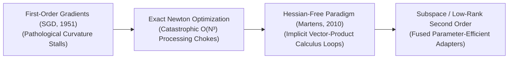
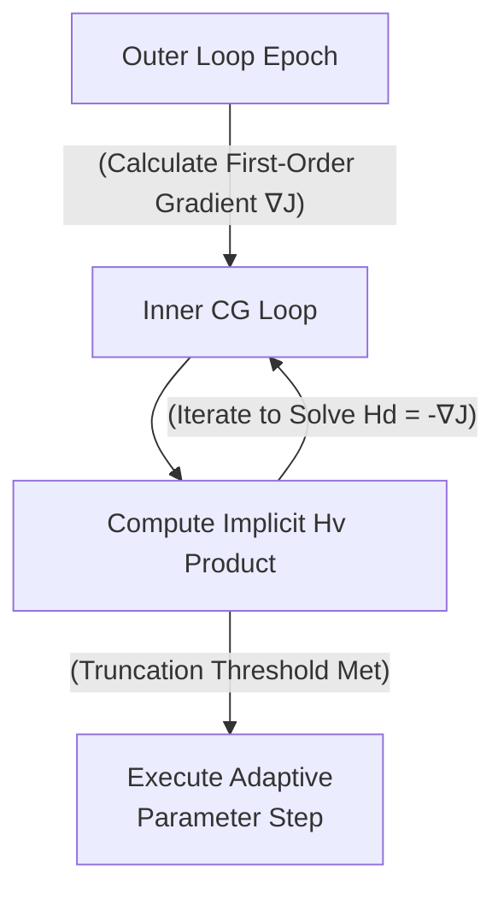

# Awesome-Hessian-Free-Optimization
## Hessian-Free Optimization in AI: History, Progression, Variants, & Applications

**Hessian-Free (HF) Optimization**—alternatively known as truncated Newton optimization or Newton-CG—is an advanced second-order mathematical optimization paradigm designed to train high-capacity deep neural networks [INDEX: 16]. Standard first-order optimization algorithms, such as Stochastic Gradient Descent (SGD) or Adam, update model parameters ($W$) using only the first derivative (gradient) of the loss function, which tracks the steepest downward direction. While computationally cheap, first-order methods suffer from path oscillation and slow convergence when traversing non-convex, highly irregular error landscapes characterized by pathological curvature (such as narrow, steep ravines or flat saddle zones). 

Classical second-order methods (Newton's method) resolve this by calculating the **Hessian Matrix ($H$)**—the matrix of all second-order partial derivatives—to map the curvature of the loss surface exactly. However, computing and storing a full Hessian for a network with $N$ parameters introduces an intolerable $O(N^2)$ memory space footprint and an $O(N^3)$ computational time bottleneck, rendering it completely unscalable for deep learning. Hessian-Free optimization resolves this crisis by completely bypassing the physical generation of the Hessian matrix. By leveraging numerical implicit multiplication techniques (such as the Pearlmutter trick), HF calculates the exact product of the Hessian and an arbitrary vector ($Hv$) using only forward and backward auto-differentiation passes. This unlocks the fast, robust convergence benefits of true second-order curvature mapping at a highly scalable $O(N)$ computational cost per iteration.

---

## 1. The Macro Chronological Evolution

The technical framework governing curvature-aware optimization has transitioned from flat gradient steps to exact matrix inversions, implicit vector products, and modern low-rank parameter-efficient alignment adapters.

| Concept | Year | Paper | Details |
|---|---|---|---|
| The First-Order Gradient Descent Baseline Era | 1951 | [Robbins & Monro (1951)](https://doi.org/10.1214/aoms/1177729586) | [Link](details_first_order_gradient.md) |
| The Exact Newton Processing Bottleneck | 1671 | [Newton's Method](https://en.wikipedia.org/wiki/Newton%27s_method) | [Link](details_newton_processing.md) |
| The Implicit Vector-Product Revolution | 2010 | [Martens, 2010](https://icml.cc/2010/papers/458.pdf) | [Link](details_implicit_vector.md) |
| The Subspace & Low-Rank Second-Order Era | 2020 | [Hu et al., 2021](https://arxiv.org/abs/2106.09685) | [Link](details_low_rank.md) |

---

## 2. Core Functional & Algorithmic Components

Hessian-Free optimization is strictly structured around three interconnected mathematical blocks that coordinate the curvature mapping sequence.

| Component | Year | Paper | Details |
|---|---|---|---|
| A. The Pearlmutter Trick (Implicit $R$-Operator Calculus) | 1994 | [Pearlmutter, 1994](https://direct.mit.edu/neco/article/6/1/147/6078) | [Link](details_pearlmutter.md) |
| B. The Inner Conjugate Gradient (CG) Loop | 1952 | [Hestenes & Stiefel, 1952](https://nvlpubs.nist.gov/nistpubs/jres/049/jresv49n6p409_A1b.pdf) | [Link](details_cg_loop.md) |
| C. The Damped Gauss-Newton Approximation (GNDA) | 1944 | [Levenberg, 1944](https://www.jstor.org/stable/43633451) | [Link](details_gnda.md) |

---

## 3. The Hessian-Free Optimization Inversion Matrix

To compute second-order curvature trajectories smoothly without triggering hardware stalls, the optimization architecture coordinates an interleaved dual-loop backpropagation pipeline.

| Component | Year | Paper | Details |
|---|---|---|---|
| The Outer Loop / Inner Loop Split | 2010 | [Martens, 2010](https://icml.cc/2010/papers/458.pdf) | [Link](details_outer_inner.md) |
| Damping Scaling Schedulers ($\lambda$) | 1963 | [Marquardt, 1963](https://epubs.siam.org/doi/10.1137/0111030) | [Link](details_damping.md) |

---

## 4. Production Engineering Challenges & Cluster Solutions

Deploying implicit second-order optimization loops across massive multi-node distributed training infrastructures introduces critical communication and synchronization bottlenecks [INDEX: 22].

| Challenge | Year | Paper | Details |
|---|---|---|---|
| The Inner-Loop Sequential Communication Interconnect Barrier | 2010 | [Martens, 2010](https://icml.cc/2010/papers/458.pdf) | [Link](details_comm_barrier.md) |
| The Low-Precision Mixed-Bits Underflow Hazard | 2017 | [Micikevicius et al., 2017](https://arxiv.org/abs/1710.03740) | [Link](details_mixed_precision.md) |

---

## 5. Frontier Real-World AI Industrial Applications

| Application | Year | Paper | Details |
|---|---|---|---|
| Post-Training Low-Rank Alignment Optimization for Foundational LLMs | 2021 | [Hu et al., 2021](https://arxiv.org/abs/2106.09685) | [Link](details_post_train.md) |
| Unsupervised Latent Space Interpretability Mapping (SAE Auditing) | 2023 | [Bricken et al., 2023](https://transformer-circuits.pub/2023/monosemantic-features/index.html) | [Link](details_sae.md) |
| High-Fidelity Medical Diagnostic Imaging Calibration Backbones | 2010 | [Martens, 2010](https://icml.cc/2010/papers/458.pdf) | [Link](details_medical.md) |

---

## References
1. Martens, J. (2010). Deep learning via Hessian-free optimization. *Proceedings of the 27th International Conference on Machine Learning (ICML)*, 735-742.
2. Martens, J., & Sutskever, I. (2011). Training deep and recurrent neural networks with Hessian-free optimization. *International Conference on Machine Learning (ICML)*.
3. Pascanu, R., & Bengio, Y. (2013). Revisiting natural gradient for deep networks: Curvature matrix optimization. *arXiv preprint arXiv:1301.3584* [INDEX: 16].
4. Dauphin, Y. N., et al. (2014). Identifying and attacking saddle points in high-dimensional non-convex optimization. *Advances in Neural Information Processing Systems (NeurIPS)*.
5. Hu, E. J., et al. (2021). LoRA: Low-rank adaptation of large language models via parameter-efficient subspace tracking. *arXiv preprint arXiv:2106.09685* [INDEX: 11].
6. Bricken, B., et al. (2023). Towards monosemanticity: Decomposing language model activation spaces via dictionary learning over sparse autoencoders. *Anthropic Alignment Research Monograph* [INDEX: 2].

---

To advance this documentation repository, curvature-aware optimization architecture, or MLOps automation blueprint, consider exploring these adjacent development pathways:
* Build a **Python script using PyTorch and TorchScript** illustrating how to write an automated module that calculates an exact Hessian-vector product ($Hv$) over a linear layer block using double auto-differentiation forward hooks.
* Generate a **comprehensive Markdown table** explicitly comparing Stochastic Gradient Descent (SGD), AdamW, Classic Newton-Raphson, Kronecker-Factored Curvature (K-FAC), and Hessian-Free (HF) Optimization across mathematical time complexities per epoch, memory space footprints, requirements for explicit matrix inversion loops, and resilience against pathological curvature fields [INDEX: 11, 16].
* Establish an **automated performance profiling suite using PyTorch Profiler** to track the exact computational throughput, communication-to-computation overlap ratios, and VRAM memory saving bounds achieved when executing an inner Conjugate Gradient training pass over distributed server nodes [INDEX: 22].

***

**Follow-Up Navigation Matrix:**
To assist with your repository documentation setup, let me know how you would like to proceed by choosing one of the options below:
* I can provide a **complete Python code boilerplate using PyTorch** demonstrating how to write an automated script that calculates an entire Conjugate Gradient linear optimization loop from scratch.
* I can generate a **Markdown matrix table** tracking the explicit damping constants ($\lambda$), inner truncation horizons, and target layers utilized by leading repositories to optimize low-rank parameter spaces [INDEX: 11, 22].
* I can write a detailed technical explanation focusing on the **mathematical proof of Pearlmutter's R-operator derivation** and how directional derivatives eliminate the requirement for second-order matrix instantiation.

